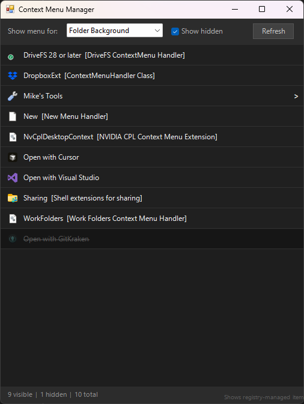

#  right-click-tidy

Hide the clutter in your Explorer right-click menu, no admin needed

Windows

<!-- media: hero -->
<!--  -->
<!-- /media: hero -->

## What it is

Over time apps stuff all sorts of things into the Explorer right-click menu. This is a little window that lists them all and lets you tick them off or back on again.

It only writes to your own user bit of the registry, so it doesn't need admin and everything can be undone. Some Windows 11 built-ins like Share or Cast to Device aren't in there because Explorer adds those itself.

Previously called `ctxmenu`.

## Get it

Paste this into your AI coding agent (Claude Code, Codex, Cursor...):

> Clone https://github.com/mikecann/right-click-tidy and make it my own. It's one of Mike
> Cann's personal tools, so read the README first, change anything specific to his
> setup to suit mine, then help me get it running.

### Or set it up by hand

You need Windows, Git, Windows PowerShell 5.1 and Windows Script Host. WinForms
is built in, so there are no packages to download or API keys to put in `.env`.

```powershell
git clone https://github.com/mikecann/right-click-tidy
cd right-click-tidy
powershell -NoProfile -ExecutionPolicy Bypass -File .\install.ps1
```

The installer puts a `right-click-tidy.bat` launcher and a Git Bash wrapper in
`C:\dev\tools`, plus shortcuts in your Start Menu. It offers to add that tools
folder to your user PATH if needed. You can pass `-ToolsDir C:\your\tools` to use
another folder, or `-SkipPathCheck` to manage PATH yourself.

Right-click `C:\dev\tools\Right Click Tidy.lnk` and choose **Pin to taskbar**
if you want it there. Keep the clone around, as the launchers use its files.
If you move the clone, run the installer again.

## Using it

Open **Right Click Tidy** from Start, or run this in a new terminal:

```powershell
right-click-tidy
```

You can also double-click `right-click-tidy.vbs`. The window opens without a
console. Choose a context from **Show menu for**, then hover over an entry
and click **Hide** or **Show**. Click **Refresh** after installing another app.

## Screenshots




## What it shows

| Category | What's scanned |
|---|---|
| All Files | `*\shell`, `*\shellex\ContextMenuHandlers`, and `Applications\*.exe` Open With app registrations |
| Folders | `Directory\shell` and `Directory\shellex\ContextMenuHandlers` |
| Folder Background | `Directory\Background\shell` and `...\shellex\...` |
| Drives | `Drive\shell` |
| Video Files | `SystemFileAssociations\.<ext>\shell`, media ProgID verbs, and All Files entries |
| Image Files | `SystemFileAssociations\.<ext>\shell`, image ProgID verbs, and All Files entries |

Both HKCU (user) and HKLM (system/app-installed) entries are shown.

## Toggling entries

Hover over an entry and click **Hide** or **Show**. Leave **Show hidden**
checked if you want to see entries you have disabled.

Changes take effect immediately - Explorer is notified via `SHChangeNotify`
so you don't need to restart it.

**How disabling works (no admin needed):**

- **Verb entries** (`Verb` / `Submenu` kind): adds an empty `LegacyDisable`
  value to a HKCU shadow key. Windows merges HKCU on top of HKLM when
  building HKCR, so this suppresses system-installed entries too.
- **COM handlers** (`ShellEx` kind): adds the handler CLSID to
  `HKCU\Software\Microsoft\Windows\CurrentVersion\Shell Extensions\Blocked`.
  Explorer honors this for system-installed handlers such as Filmora.
- **Open With apps** (`OpenWith` kind): adds `NoOpenWith` under the HKCU
  `Software\Classes\Applications\<app>.exe` shadow key. This hides app-level
  suggestions like `Open with Zed` without deleting the app registration.

To re-enable, click **Show**. The disabling value or blocked CLSID is removed.

## What it won't show

- Some Windows 11 dynamic or packaged-app commands are injected by Explorer
  rather than exposed as simple registry verbs. Examples include parts of
  Copilot, Share, Defender, Cast to Device, and some AppX commands.

## Tests and diagnostics

On Windows, run these from the clone in separate processes:

```powershell
powershell -NoProfile -ExecutionPolicy Bypass -File .\test-install-lib.ps1
powershell -NoProfile -ExecutionPolicy Bypass -File .\test-install.ps1
powershell -NoProfile -ExecutionPolicy Bypass -File .\run-tests.ps1
```

The registry tests create temporary HKCU entries, check Open With and COM
handler toggles, then clean up. The installer tests use temporary directories
and leave your real Start Menu and PATH alone. The launcher and icon helper
tests also work on macOS with `pwsh -NoProfile -File ./test-install-lib.ps1`.

For a registry dump or a comparison with a real Explorer menu:

```powershell
powershell -NoProfile -ExecutionPolicy Bypass -File .\diag.ps1 -Ext .mp4
powershell -NoProfile -ExecutionPolicy Bypass -File .\test-compare.ps1 -TestFile C:\path\to\video.mp4
```

These write reports beside the scripts. `diag2.ps1` prints extra image-menu
registry details to the console.

## Uninstalling

```powershell
powershell -NoProfile -ExecutionPolicy Bypass -File .\uninstall.ps1
```

Use the same `-ToolsDir` if you installed somewhere else. This removes this
clone's launchers and shortcuts. Your menu choices stay in the registry, so
use **Show** for any entries you want to restore before uninstalling. Unpin
its taskbar shortcut yourself if you pinned it. The shared tools folder stays
on PATH.

## Notes

- No external dependencies, uses built-in .NET WinForms.
- All writes go to HKCU, never modifies HKLM directly.
- Toggling entries is reversible.
- The PNG icons are from [Mark James's famfamfam silk set](https://www.famfamfam.com/lab/icons/silk/), licensed under [CC BY 2.5](https://creativecommons.org/licenses/by/2.5/). That attribution applies to the icons; the code is MIT licensed.

## More tools

You can find my other tools at [mikerosoft.app](https://mikerosoft.app).

MIT licensed.
